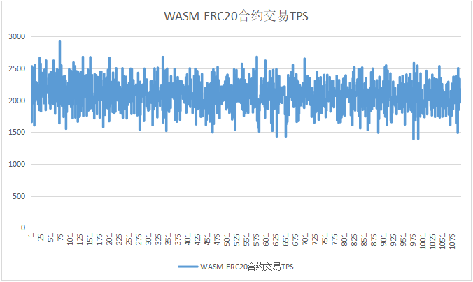

# Alaya-0.16.0性能测试

本次主要是针对 Alaya 0.16.0 版本进行性能回归测试，模拟质押101节点并分别发送普通转账、EVM-ERC20、WASM-ERC20合约交易，持续3小时进行压测，观察所有节点的运行的情况，并从交易延迟、交易吞吐量、节点资源占用等几项指标进行分析。本次测试交易用户数为6000。

## 测试环境

本次测试采用百度云、阿里云、华为云共104台服务器，机器在地理位置上分散在全球10多个区域。机器设定为中低配置，其中配置较高的3台机器作为插件节点使用。

| CPU核数 | CPU主频 | 内存 | 硬盘     | 带宽    | 数量 |
| ------- | ------- | ---- | -------- | ------- | ---- |
| 4       | 2.50GHz | 8G   | HDD 200G | 100Mbps | 101  |
| 8       | 2.50GHz | 16G  | SSD 200G | 100Mbps | 3    |

## 测试工具

在现实场景中交易一般都是通过不同区块链节点的RPC接口发送到链上，但是性能测试时用RPC接口来发送交易会有以下问题：

1. 现实场景中，通过RPC接口接收交易的节点非常多，且分布广，在实测中很难模拟。

2. 如果只通过数量较少的几个节点发送交易，性能瓶颈往往处于RPC接口，导致不能模拟足够的测试压力。

2. 现实场景中共识节点收到的交易绝大部分是通过节点间的P2P广播收到的，而不是通过其RPC接口。

因此，本次测试实现了专门针对性能测试的测试插件，通过在插件中直接产生交易并通过P2P广播的方式，将交易广播到共识节点，尽量避免性能受RPC接口的影响。

图1 测试工具整体方案

测试插件的基本流程为：

1. 初始化测试账户，模拟大量并发用户
2. 构建测试交易，并随机选择测试账户进行签名
3. 发送交易

## 测试过程

本次测试总共部署104个节点，初始25个共识节点，76个待质押节点，3个插件节点。

测试时间从2021-06-24至2021-06-28，共计3个工作日。

## 压测用例

1. 初始25个共识节点 + 3插件节点，执行普通转账交易压测
2. 初始25共识节点+3插件节点+质押76节点，执行普通转账交易压测，其中--maxpeers 35且每个插件每秒发送1500笔交易
3. 初始25共识节点+3插件节点+质押76节点，执行普通转账交易压测，其中--maxpeers 30且每个插件每秒发送1100笔交易
4. 初始25共识节点+3插件节点+质押76节点，执行EVM-ERC20合约交易压测，其中--maxpeers 30且每个插件每秒发送900笔交易
5. 初始25共识节点+3插件节点+质押76节点，执行WASM-ERC20合约交易压测，其中--maxpeers 30且每个插件每秒发送800笔交易

## 测试结果

### 原生Token转账

用例1 资源消耗

用例2 资源消耗

用例3 资源消耗

### EVM-ERC20合约交易

EVM-ERC20 资源消耗

### WASM-ERC20合约交易

WASM-ERC20 资源消耗

## 7 测试总结

|              | TPS  | TTF   | 交易标准差 | 备注                                |
| ------------ | ---- | ----- | ---------- | ----------------------------------- |
| 转账 - 用例1 | 4537 | 11.3s | 510.34     | 所有节点均正常稳定运行              |
| 转账 -用例2  | 3883 | 12.5s | 670.99     | 运行1小时后，陆续有节点被oom killed |
| 转账 -用例3  | 3295 | 5.5s  | 311.86     | 所有节点均正常稳定运行              |
| EVM-ERC20    | 2403 | 14.1s | 265.11     | 所有节点均正常稳定运行              |
| WASM-ERC20   | 2088 | 14.9s | 240.01     | 所有节点均正常稳定运行              |

通过对此次测试的结果分析，总结如下：

1. 本次版本优化了交易扩散逻辑，压测期间网络出入流量有所增加，特别是入流量增加明显。
2. 在持续大量交易压测下，新增的交易扩散逻辑会导致节点发送、接收大量NewPooledTransactionHashesMsg消息，解析这些消息会耗费大量内存。

3. 通过减小节点最大连接数 maxpeers 和插件交易发送频率，降低网络的NewPooledTransactionHashesMsg消息，从而避免节点被oom kill，在普通转账压测时 maxpeers 设置为30节点比较稳定。
4. 因为降低了插件交易发送频率，所以各节点没有达到满负荷状态，CPU和内存使用率不是很高。
5. 在所有节点稳定运行的前提下，普通转账TPS较上一个版本有所下降（交易发送频率降低），合约交易TPS和上一个版本基本一致。
6. 系统在持续大量交易负载下，节点有被 oom kill 的风险。
