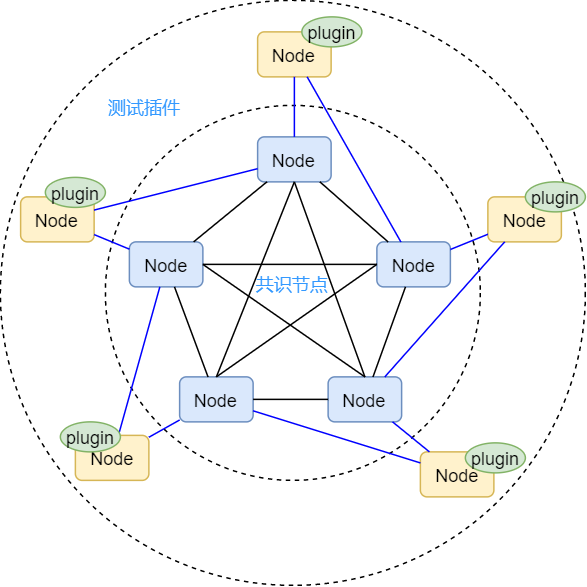
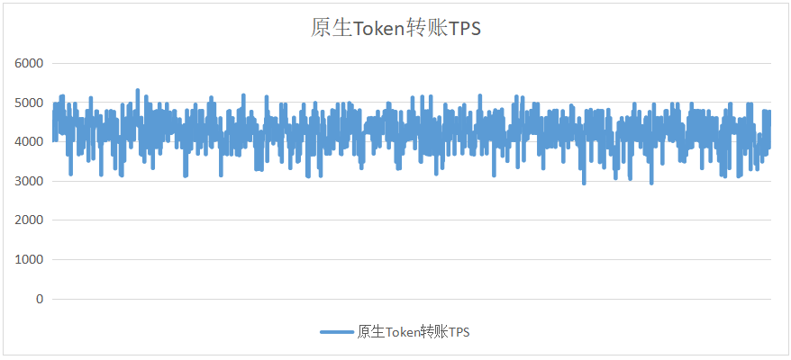
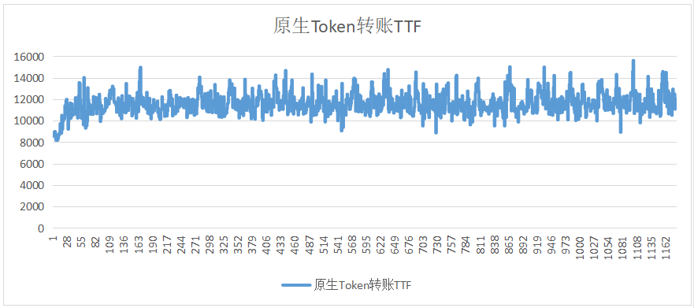
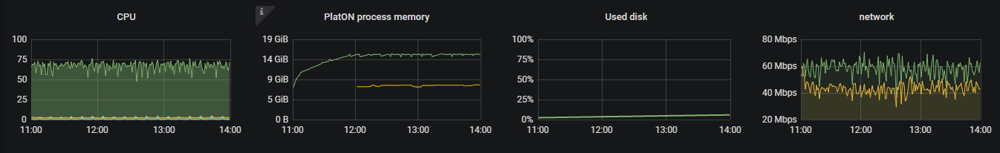
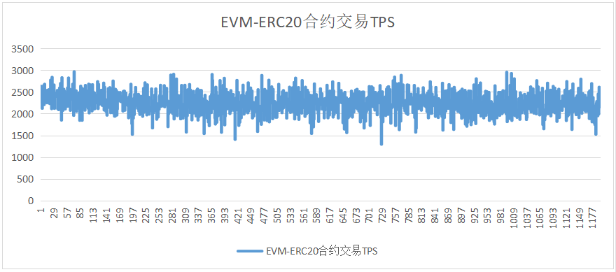
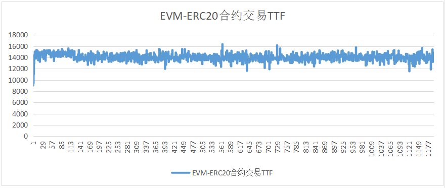
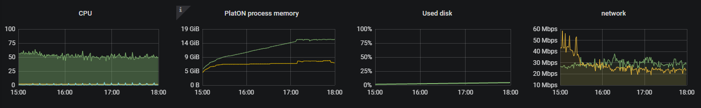
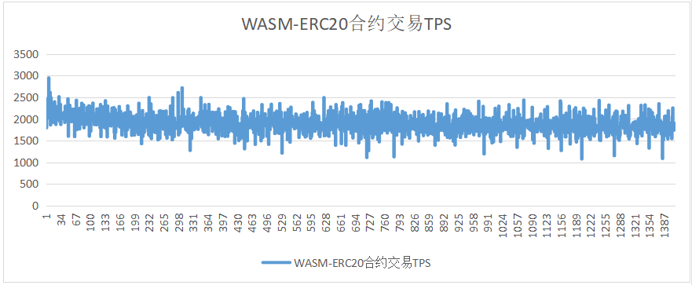
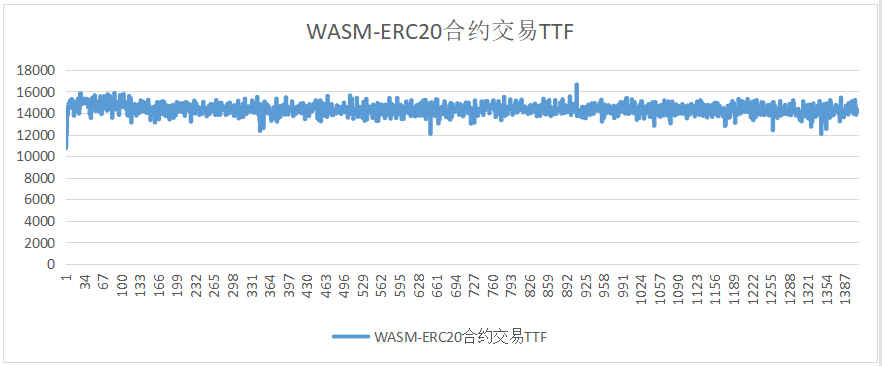
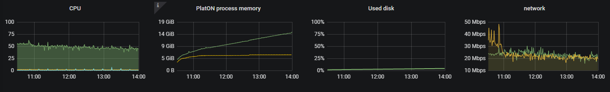

# Alaya-0.16.1性能测试

本次主要是针对 Alaya 0.16.1 版本进行性能回归测试，模拟质押201节点并分别发送普通转账、EVM-ERC20、WASM-ERC20合约交易，持续3小时进行压测，观察所有节点的运行的情况，并从交易延迟、交易吞吐量、节点资源占用等几项指标进行分析。本次测试交易用户数为6000。

## 测试环境

本次测试采用谷歌云（150台）、阿里云（43台）、百度云（11台），共计204台服务器，机器在地理位置上分散在全球10多个区域。机器设定为中低配置，其中配置较高的3台机器作为插件节点使用。

| CPU核数 | CPU主频 | 内存 | 硬盘     | 带宽    | 数量 |
| ------- | ------- | ---- | -------- | ------- | ---- |
| 4       | 2.50GHz | 16G  | HDD 300G | 100Mbps | 201  |
| 4       | 2.50GHz | 16G  | SSD 300G | 100Mbps | 3    |

## 测试工具

在现实场景中交易一般都是通过不同区块链节点的RPC接口发送到链上，但是性能测试时用RPC接口来发送交易会有以下问题：

1. 现实场景中，通过RPC接口接收交易的节点非常多，且分布广，在实测中很难模拟。

2. 如果只通过数量较少的几个节点发送交易，性能瓶颈往往处于RPC接口，导致不能模拟足够的测试压力。

2. 现实场景中共识节点收到的交易绝大部分是通过节点间的P2P广播收到的，而不是通过其RPC接口。

因此，本次测试实现了专门针对性能测试的测试插件，通过在插件中直接产生交易并通过P2P广播的方式，将交易广播到共识节点，尽量避免性能受RPC接口的影响。

图1 测试工具整体方案

测试插件的基本流程为：

1. 初始化测试账户，模拟大量并发用户
2. 构建测试交易，并随机选择测试账户进行签名
3. 发送交易

## 测试过程

本次测试总共部署204个节点，初始25个共识节点，176个待质押节点，3个插件节点。

测试时间从2021-09-07至2021-09-08，共计2个工作日。

## 压测用例

2. 初始25共识节点+3插件节点+质押176节点，执行普通转账交易压测，其中每个插件每秒发送1600笔交易
4. 初始25共识节点+3插件节点+质押176节点，执行EVM-ERC20合约交易压测，其中每个插件每秒发送1100笔交易
5. 初始25共识节点+3插件节点+质押176节点，执行WASM-ERC20合约交易压测，其中每个插件每秒发送1000笔交易

## 测试结果

### 原生Token转账

### EVM-ERC20合约交易

EVM-ERC20 资源消耗

### WASM-ERC20合约交易

WASM-ERC20 资源消耗

## 7 测试总结

|               | TPS  | TTF    | 交易标准差 | 备注                   |
| ------------- | ---- | ------ | ---------- | ---------------------- |
| 原生Token转账 | 4241 | 11.58s | 700.12     | 所有节点均正常稳定运行 |
| EVM-ERC20     | 2248 | 14.04s | 316.09     | 所有节点均正常稳定运行 |
| WASM-ERC20    | 1904 | 14.34s | 298.73     | 所有节点均正常稳定运行 |

通过对此次测试的结果分析，总结如下：

1. 本次测试所有节点均能正常稳定运行，节点出块、跟块正常，没有出现 panic、oom kill 的现象。
2. 本次测试没有限定节点的连接数，采用默认配置（MaxPeers默认值60，MaxConsensusPeers默认值40），且质押节点总数为201，三种场景下的TPS均有所下降，但差距不大（100~200之间的差异）。
3. 在压测过程中，PlatON进程平均占用内存为8GB左右，观察到部分节点峰值为12GB，但随后内存有回收。
4. 由于交易扩散逻辑的存在，压测期间网络出入流量有所增加，特别是入流量增加明显，加上没有节点连接数的限制，各节点接收处理的消息量增加，导致三种场景下的区块平均确认时间均有所增加，即区块共识达成变慢。
