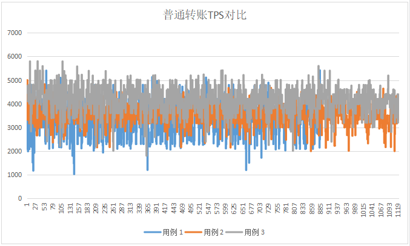

# PlatON-1.1.0性能测试

本次主要是针对 PlatON 1.1.0 版本进行性能回归测试，前后采用3个版本（交易hash全部广播版本、交易hash部分广播版本、交易hash部分广播+限制节点连接数版本），模拟质押201节点并发送普通转账，分别持续3小时进行压测，观察所有节点的运行的情况，并从交易延迟、交易吞吐量、节点资源占用等几项指标进行分析。本次测试交易用户数为6000。

## 测试环境

本次测试采用百度云、阿里云、华为云共104台服务器，机器在地理位置上分散在全球10多个区域。机器设定为中配置，其中配置较高的3台机器作为插件节点使用。

| CPU核数 | CPU主频 | 内存 | 硬盘     | 带宽    | 数量 |
| ------- | ------- | ---- | -------- | ------- | ---- |
| 4       | 2.50GHz | 16G  | HDD 200G | 100Mbps | 201  |
| 8       | 2.50GHz | 16G  | SSD 200G | 100Mbps | 3    |

## 测试工具

在现实场景中交易一般都是通过不同区块链节点的RPC接口发送到链上，但是性能测试时用RPC接口来发送交易会有以下问题：

1. 现实场景中，通过RPC接口接收交易的节点非常多，且分布广，在实测中很难模拟。

2. 如果只通过数量较少的几个节点发送交易，性能瓶颈往往处于RPC接口，导致不能模拟足够的测试压力。

2. 现实场景中共识节点收到的交易绝大部分是通过节点间的P2P广播收到的，而不是通过其RPC接口。

因此，本次测试实现了专门针对性能测试的测试插件，通过在插件中直接产生交易并通过P2P广播的方式，将交易广播到共识节点，尽量避免性能受RPC接口的影响。

图1 测试工具整体方案

测试插件的基本流程为：

1. 初始化测试账户，模拟大量并发用户
2. 构建测试交易，并随机选择测试账户进行签名
3. 发送交易

## 测试过程

本次测试总共部署204个节点，初始43个共识节点，158个待质押节点，3个插件节点。

测试时间从2021-07-01至2021-07-02，共计2个工作日。

## 压测用例

2. 交易hash全部广播版本：初始43共识节点+3插件节点+质押158节点，执行普通转账交易压测，不指定--maxpeers（默认50）和--maxconsensuspeers（默认100）。每个插件每秒发送1700笔交易
3. 交易hash部分广播版本：初始43共识节点+3插件节点+质押158节点，执行普通转账交易压测，不指定--maxpeers（默认50）和--maxconsensuspeers（默认100），交易hash广播给不超过5个节点。每个插件每秒发送1500笔交易
4. 交易hash部分广播+限制节点连接数版本：初始43共识节点+3插件节点+质押158节点，执行普通转账交易压测，其中--maxpeers 设置为35， --maxconsensuspeers 设置为30，交易hash广播给不超过5个节点。每个插件每秒发送1800笔交易

## 测试结果

### 原生Token转账

## 7 测试总结

|              | TPS  | TTF    | 交易标准差 | 备注                                               |
| ------------ | ---- | ------ | ---------- | -------------------------------------------------- |
| 转账 - 用例1 | 3078 | 15.86s | 1189.78    | 所有节点均正常稳定运行，大部分节点内容使用超过了8G |
| 转账 -用例2  | 3516 | 12.73s | 577.21     | 所有节点均正常稳定运行，大部分节点内容使用超过了8G |
| 转账 -用例3  | 4086 | 13.08s | 735.72     | 所有节点均正常稳定运行，大部分节点内容使用超过了8G |

通过对此次测试的结果分析，总结如下：

1. 本次版本优化了交易扩散逻辑，压测期间网络出入流量有所增加，特别是入流量增加明显。

2. 在持续大量交易压测下，新增的交易扩散逻辑会导致节点发送、接收大量NewPooledTransactionHashesMsg消息，解析这些消息会耗费大量内存。

3. 在用例1测试过程中，发现整个网络消息数量太多，节点消耗大量内存且影响共识效率，因此用例2修改为交易hash只广播给不超过5个节点，并且降低插件交易发送频率。

4. 用例3在用例2基础上，进一步控制每个节点的连接数（--maxpeers 35， --maxconsensuspeers 30），并提高插件交易发送频率，节点性能基本和PlatON 1.0.0持平，但内存消耗比上一个版本高。

5. 用例3测试过程中（--maxpeers 35， --maxconsensuspeers 30）出现了”网络分区“，通过调整节点连接数的逻辑，该问题已经解决，新逻辑如下：

   - MaxPeers包含了MaxConsensusPeers，即MaxPeers的设置必须大于MaxConsensusPeers

   - 共识节点连接数超过了MaxConsensusPeers设置，一律不允许再添加consensusDialedConn

   - 共识节点连接数没有超过MaxConsensusPeers设置，但连接总数超过了MaxPeers设置

     ​	当前节点是共识节点：断开一个非consensusDialedConn，并允许请求的consensusDialedConn连接（一断一连保持不超过MaxPeers）
     ​    当前节点不是共识节点：不允许连接

   - trustedConn、staticDialedConn连接不受MaxPeers限制
   - MaxPeers默认值60，MaxConsensusPeers默认值40

6. 系统在持续大量交易负载下，节点在低配置机器上运行有被 oom kill 的风险。
